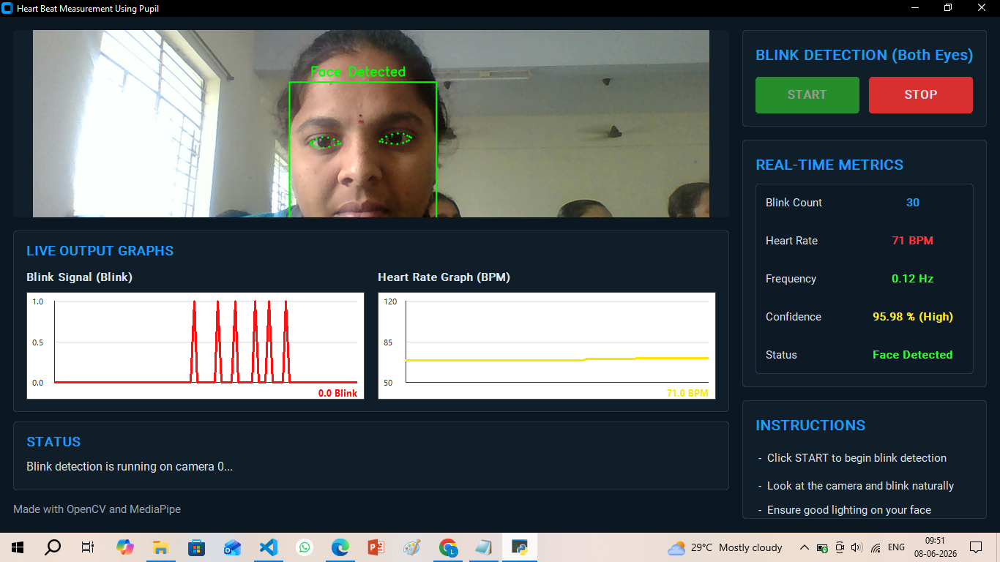

# Heart Beat Measurement Using Pupil

Heart Beat Measurement Using Pupil is a real-time computer vision project that uses a webcam to detect the face and eye landmarks, count blinks, estimate heart-rate-related output, and show live graphs for blink signal and heart rate.

## Features

- Real-time face detection
- Eye landmark tracking using MediaPipe
- Blink count detection
- Heart rate display
- Frequency and confidence metrics
- Live blink signal graph
- Live heart rate graph
- Simple desktop GUI using CustomTkinter

## Output Screenshot



## Technologies Used

- Python
- OpenCV
- MediaPipe
- CustomTkinter
- Pillow
- NumPy

## Project Structure

```text
heart_beat_measurement/
|-- app.py
|-- detector.py
|-- requirements.txt
|-- screenshots/
|   |-- output.png
|-- README.md
```

## Installation

```bash
git clone https://github.com/LikithaNandini2006/heart_beat_measurement.git
cd heart_beat_measurement
python -m venv venv
venv\Scripts\activate
pip install -r requirements.txt
```

## Run The Project

```bash
python app.py
```

After running the project, click `START` to begin blink detection. The app will open the webcam, detect the face and eyes, update blink count, and show live output graphs.

## Author

Likitha Nandini

GitHub: https://github.com/LikithaNandini2006
